# Projeto Defenda-se da Invasão.

# Equipe
  * Pedro Hori Bueno - RA 223402
  * Matheus Augusto da Silva Cândido - RA 241640

# Descrição Resumida do Projeto
Este é um jogo single player no qual o jogador tem como objetivo impedir a invasão de inimigos em seu território utilizando defesas estáticas que podem ser construídas ao decorrer do jogo utilizando recursos.  
    O tabuleiro do jogo será dividido por células, de modo que cada célula pode estar vazia, conter alguma unidade aliada (construída pelo jogador), conter alguma unidade inimiga, ou conter alguma peça estática (característica do próprio tabuleiro criado). As unidades inimigas surgem nas células mais à direita do tabuleiro, e conforme as rodadas passam elas se movem para a parte esquerda do tabuleiro. Se alguma unidade inimiga conseguir alcançar a extremidade esquerda do tabuleiro sem ser impedida ou morta, o jogador perde o jogo. O jogador vence o jogo quando as rodadas acabarem e todas as unidades inimigas forem eliminadas no tabuleiro. Pretendemos criar diversos tipos de unidades inimigas e aliadas (cada uma representada por uma classe diferente) que interajam com sua vizinhança de maneiras distintas e criativas.  
	O jogo seria dividido em fases com  diferentes dificuldades. Cada fase possuiria um tabuleiro levemente diferente (em que as peças estáticas são posicionadas de maneira diferente) e as unidades aliadas disponíveis seriam diferentes assim como as inimigas que estariam invadindo.  
	Também gostaríamos de utilizar uma boa interface gráfica para o jogo. Desta forma cada peça possuiria um nome e desenho relativo a ela baseado na temática do jogo, o que tornaria o jogo menos abstrato e melhoraria a experiência do jogador.  
  
# Vídeo do Projeto
* [Video com explicação básica do jogo](https://drive.google.com/file/d/1PenhFqBI79RkenKXz6Xt08x29YHh8kXR/view?usp=sharing)
# Slide do Projeto
* [Slide do projeto](https://docs.google.com/presentation/d/1OUHMlqgoMDY4zieyRQ7nLU_UCLnYMEF865pBTfMvgnE/edit?usp=sharing)
# Diagrama Geral de Componentes
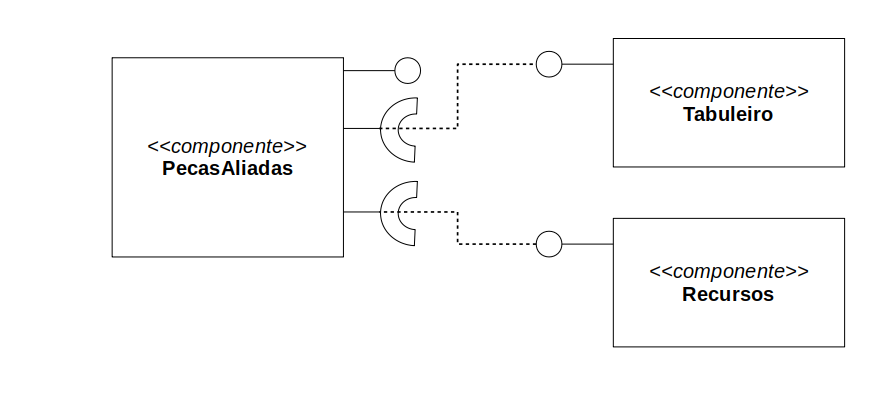
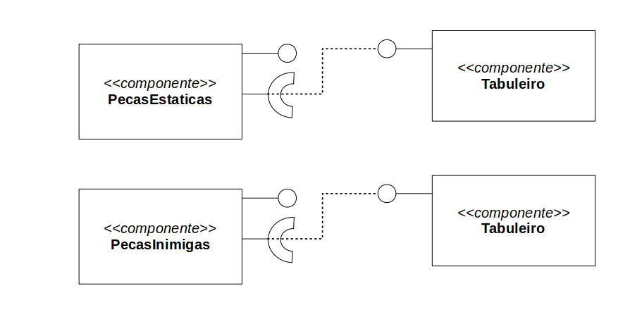

## Classes associadas
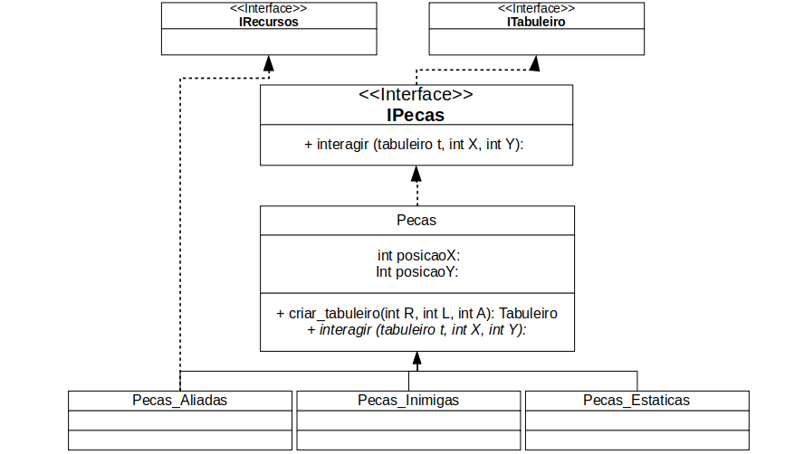
 * O delhamento será feito mais abaixo!
# Componente Tabuleiro
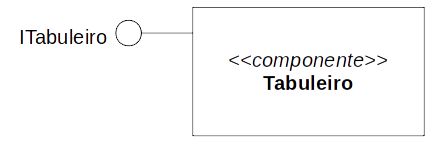
## Interfaces 
Interfaces associadas a este componente.
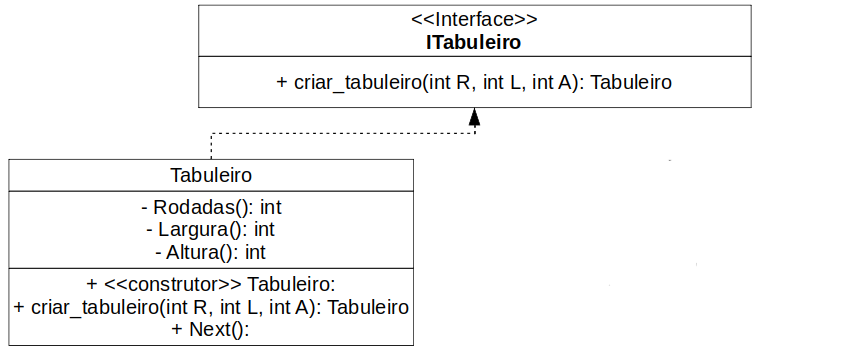
|Campo | Valor |
|----- |-------|
|Classe|pt.principal|
|Autores|Pedro Hori Bueno, Matheus Augusto da Silva Cândido|
|Objetivo|Este componente tem como objetivo controlar o tabuleiro do jogo. |
|Interface|public ITabuleiro|

public ITabuleiro{  
 public void criar_tabuleiro(int R, int L, int A);  
}

## Detalhamento das Interfaces

### Interface ITabuleiro
Essa interface é responsável por assegurar as ações basicas para o funcionamento do tabuleiro.

|Método | Objetivo |
|-------|----------|
|public void criar_tabuleiro(int R, int L, int A);|tornar possivel criar o tabuleiro inicial para cada rodada, gera o tabuleiro inicial da rodada|

# Componente Recursos
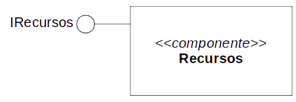
## Interfaces 
Interfaces associadas a este componente.
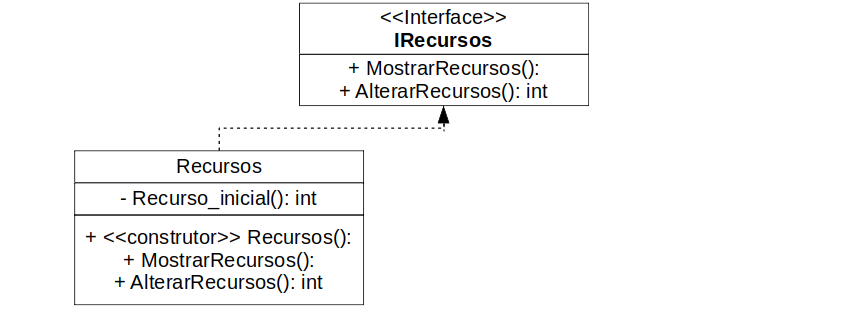
|Campo | Valor |
|----- |-------|
|Classe|pt.principal|
|Autores|Pedro Hori Bueno, Matheus Augusto da Silva Cândido|
|Objetivo|Armazenar os recursos para a produção de peças aliadas|
|Interface|public IRecursos|

public IRecursos{  
 public void MostrarRecursos();  
 public int AlterarRecursos();  
}

## Detalhamento das Interfaces

### Interface IRecursos
Controla e monitora os recursos que o usuario possui.

|Método | Objetivo |
|-------|----------|
|public void MostrarRecursos();|mostra na tela os recursos disponiveis|
|public int AlterarRecursos();|altera e retorna a quantidade de recursos|

# Componente PecasAliadas
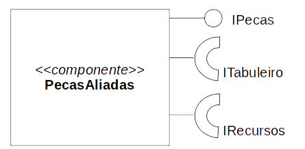
## Interfaces 
Interfaces associadas a este componente.
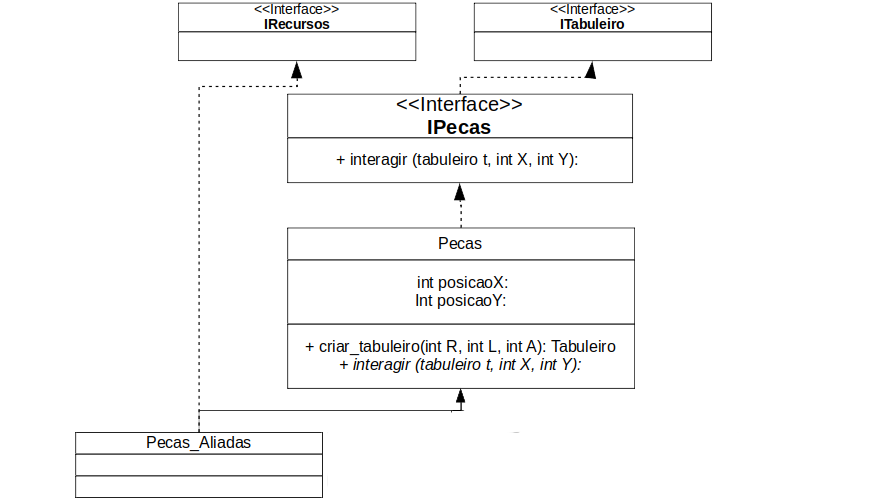
* Expandindo Pecas_Aliadas
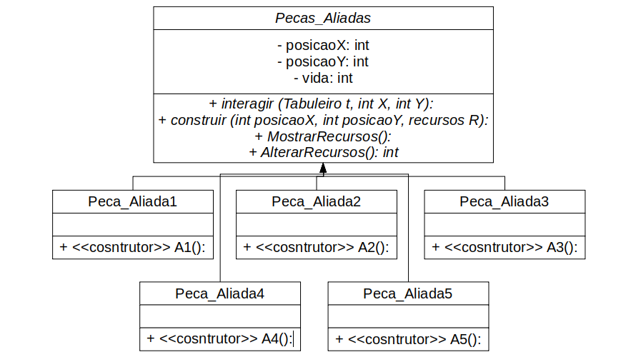

|Campo | Valor |
|----- |-------|
|Classe|pt.principal.pecas|
|Autores|Pedro Hori Bueno, Matheus Augusto da Silva Cândido|
|Objetivo|refere-se a todos os tipos de peças aliadas, mais precisamente as cinco como na imagem acima|
|Interface|public ITabuleiro; public IRecursos; public IPecas;|

public ITabuleiro{  
 public void criar_tabuleiro(int R, int L, int A);  
}  
public IRecursos{   
 public void MostrarRecursos();   
 public int AlterarRecursos();   
}  
public IPecas{  
 public void Interagir(Tabuleiro t, int X, int Y);  
}

## Detalhamento das Interfaces
### Interface ITabuleiro
Essa interface é responsável por assegurar as ações basicas para o funcionamento do tabuleiro.

|Método | Objetivo |
|-------|----------|
|public void criar_tabuleiro(int R, int L, int A);|tornar possivel criar o tabuleiro inicial para cada rodada, gera o tabuleiro inicial da rodada|

### Interface IRecursos
Controla e monitora os recursos que o usuario possui.

|Método | Objetivo |
|-------|----------|
|public void MostrarRecursos();|mostra na tela os recursos disponiveis|
|public int AlterarRecursos();|altera e retorna a quantidade de recursos|

### Interface IPecas
Tem como papel unificar os três tipos macros de peças: aliadas, inimigas e estaticas;

|Método | Objetivo |
|-------|----------|
|public void Interagir(Tabuleiro t, int X, int Y)| nas peças aliadas executa as interações de defesa e ataque para com o espaço celular,ja que essas peças nao se movem|

# Componente PecasInimigas
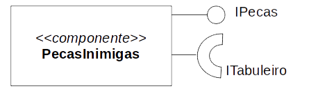
## Interfaces 
Interfaces associadas a este componente.

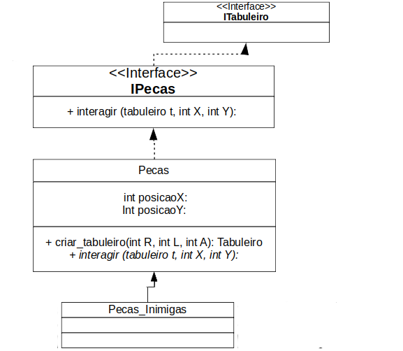
* Expandindo Pecas_Inimigas
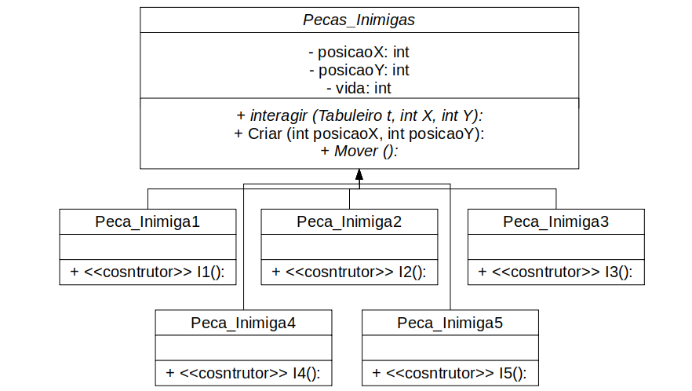

|Campo | Valor |
|----- |-------|
|Classe|pt.principal.pecas|
|Autores|Pedro Hori Bueno, Matheus Augusto da Silva Cândido|
|Objetivo|refere-se a todos os tipos de peças inimigas, mais precisamente as cinco como na imagem acima|
|Interface|public ITabuleiro; public IPecas;|

public ITabuleiro{  
 public void criar_tabuleiro(int R, int L, int A);  
}  
public IPecas{  
 public void Interagir(Tabuleiro t, int X, int Y);  
}  

## Detalhamento das Interfaces
### Interface ITabuleiro
Essa interface é responsável por assegurar as ações basicas para o funcionamento do tabuleiro.

|Método | Objetivo |
|-------|----------|
|public void criar_tabuleiro(int R, int L, int A);|tornar possivel criar o tabuleiro inicial para cada rodada, gera o tabuleiro inicial da rodada|

### Interface IPecas
Tem como papel unificar os três tipos macros de peças: aliadas, inimigas e estaticas;

|Método | Objetivo |
|-------|----------|
|public void Interagir(Tabuleiro t, int X, int Y)| nas peças inimigas, realiza o movimento delas, ou ataca peças aliadas ou estaticas|

# Componente PecasEstaticas
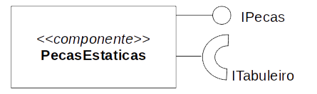
## Interfaces 
Interfaces associadas a este componente.

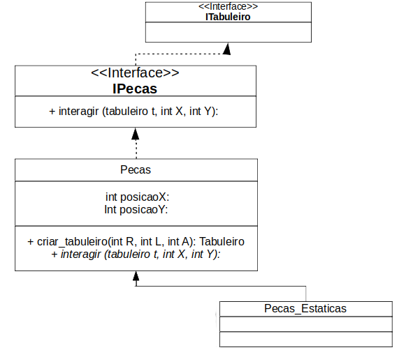
* Expandindo Pecas_Estaticas.
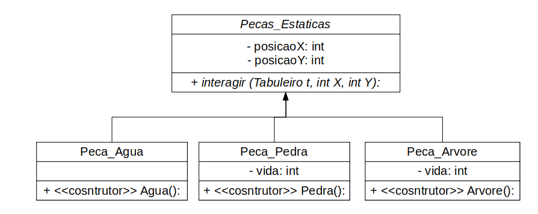

|Campo | Valor |
|----- |-------|
|Classe|pt.principal.pecas|
|Autores|Pedro Hori Bueno, Matheus Augusto da Silva Cândido|
|Objetivo|refere-se aos três tipos de peças estaticas: árvore, pedra, água|
|Interface|public ITabuleiro; public IPecas;|

public ITabuleiro{  
 public void criar_tabuleiro(int R, int L, int A);  
}  
public IPecas{  
 public void Interagir(Tabuleiro t, int X, int Y);  
}  
## Detalhamento das Interfaces

### Interface ITabuleiro
Essa interface é responsável por assegurar as ações basicas para o funcionamento do tabuleiro.

|Método | Objetivo |
|-------|----------|
|public void criar_tabuleiro(int R, int L, int A);|tornar possivel criar o tabuleiro inicial para cada rodada, gera o tabuleiro inicial da rodada|

### Interface IPecas
Tem como papel unificar os três tipos macros de peças: aliadas, inimigas e estaticas;

|Método | Objetivo |
|-------|----------|
|public void Interagir(Tabuleiro t, int X, int Y)| nas peças estaticas faz a interação de modo a ajudar ou atrapalhar o ataque e a defesa em cada rodada|

