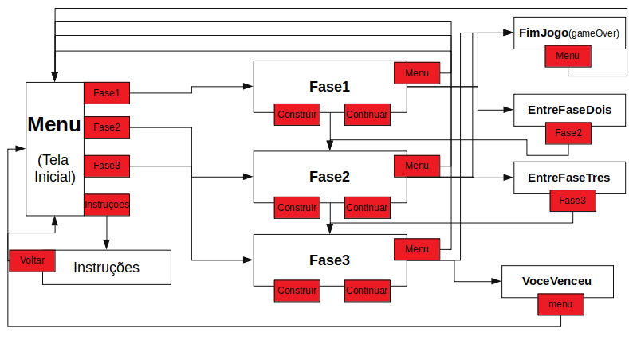
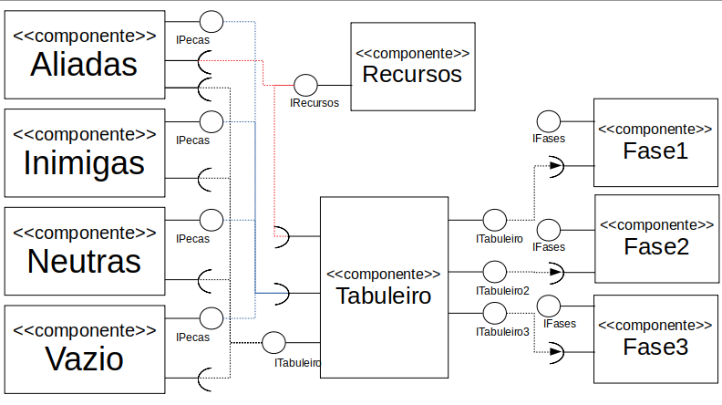
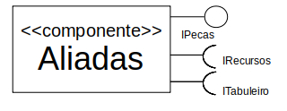
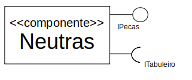
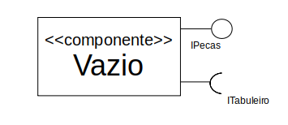
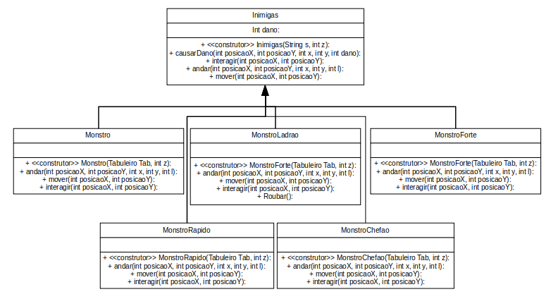
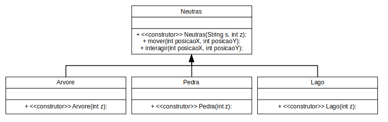
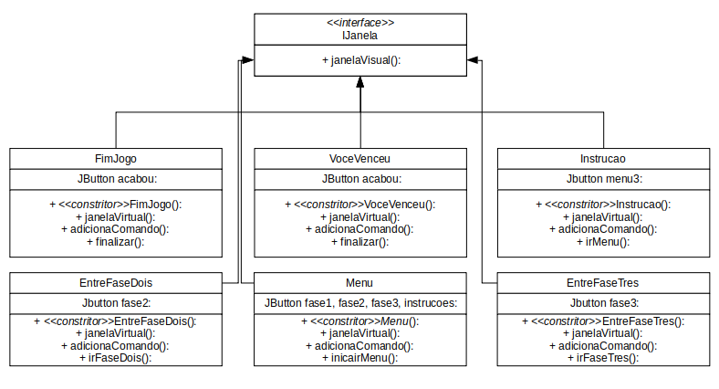
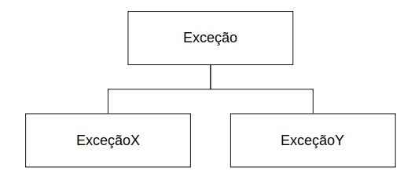

# Projeto Defenda-se da Invasão.

# Equipe
  * Pedro Hori Bueno - RA 223402
  * Matheus Augusto da Silva Cândido - RA 241640

# Descrição Resumida do Projeto
Este é um jogo single player no qual o jogador tem como objetivo impedir a invasão de inimigos em seu território utilizando defesas estáticas que podem ser construídas ao decorrer do jogo utilizando recursos.  
    O tabuleiro do jogo será dividido por células, de modo que cada célula pode estar vazia, conter alguma unidade aliada (construída pelo jogador), conter alguma unidade inimiga, ou conter alguma peça estática (característica do próprio tabuleiro criado). As unidades inimigas surgem nas células mais à direita do tabuleiro, e conforme as rodadas passam elas se movem para a parte esquerda do tabuleiro. Se alguma unidade inimiga conseguir alcançar a extremidade esquerda do tabuleiro sem ser impedida ou morta, o jogador perde o jogo. O jogador vence o jogo quando as rodadas acabarem e todas as unidades inimigas forem eliminadas no tabuleiro. Pretendemos criar diversos tipos de unidades inimigas e aliadas (cada uma representada por uma classe diferente) que interajam com sua vizinhança de maneiras distintas e criativas.  
	O jogo seria dividido em fases com  diferentes dificuldades. Cada fase possuiria um tabuleiro levemente diferente (em que as peças estáticas são posicionadas de maneira diferente) e as unidades aliadas disponíveis seriam diferentes assim como as inimigas que estariam invadindo.  
	Também gostaríamos de utilizar uma boa interface gráfica para o jogo. Desta forma cada peça possuiria um nome e desenho relativo a ela baseado na temática do jogo, o que tornaria o jogo menos abstrato e melhoraria a experiência do jogador.  
  
# Vídeos do Projeto
## Vídeo da Prévia
* [Video com explicação básica do jogo](https://drive.google.com/file/d/1PenhFqBI79RkenKXz6Xt08x29YHh8kXR/view?usp=sharing)
## Vídeo do Jogo
*
# Slides do Projeto
## Slides da Previa
* [Slide do projeto](https://docs.google.com/presentation/d/1OUHMlqgoMDY4zieyRQ7nLU_UCLnYMEF865pBTfMvgnE/edit?usp=sharing)
## Slides da Apresentação Final
*
## Relatório de Evolução
Este projeto sofreu diversas alterações ao longo de seu desenvolvimento, tanto alterações simples de atributos básicos das unidades quanto alterações mais complexas que mudavam de maneira significativa a estrutura do programa. Inicialmete, o jogo começou a ser prográmado com interfaces gráficas muito mais simples em que o tabuleiro e as peças eram feitas com Strings, de maneira similar ao que foi feito nos programas da dama e do xadrez. Além disso, foi implementada somente uma fase de testes, sem possuir um menu inicial. Nós utilizamos este códico mais simplificado para testar todas as interações de vizinhança entre as peças, descartando as ideias inviáveis e desenvolvendo novas interações. Também utilizamos este código para testar o balanceamento do jogo mudando atributos básicos das peças como "dano", "vida" ou "custo", de maneira a melhorar a experiência do jogador. Após o programa estar rodando perfeitamente nesta interface gráfica simplificada, começamos a implementar a interface gráfica definitiva. Neste processo, acabamos criando novas interfaces e classes que não estavam previstas inicialmente no projeto, como uma interface para criar diferentes fases. Implementamos 3 fases com diferentes unidades e níveis de dificuldade, além de uma área de menu, onde o jogador pode selecionar a fase que ele deseja jogar, e uma página com as instruções de como se jogar o jogo.

Após concluirmos a implementação da interface gráfica final o jogo estava praticamente pronto. Nós nos dedicamos por fm a deixar o layout do jogo o melhor e mais intuitivo possível. Alteramos as posições de botões e de informações na tela, alteramos o modo de se selicionar unidades e criamos telas intermediárias para direcionar o jogador durante o jogo. 

Finalmente, depois destas mudanças finais, o jogo foi concluido.

Cabe ressaltar, que as grandes dificuldades encontradas foram em estruturas de Pattern, e na diagramação de telas. Buscando entender melhor as restrições de cada tipo de Layout, o jogo foi implementado da forma que mais se encaixava nos Layouts escolhidos.

# Destaques de Código
# Destaques de Pattern
## Diagrama do Pattern

## Código do Patern
# Conclusões e Trabalhos Futuros
Após finalizarmos o projeto, concluimos que ainda há muito que pode ser explorado dentro deste jogo. A programação das classes assim como a escolha de interfaces foi feita de modo que é fácil de se criar novas fases, assim como novas peças. Muitas ideias de peças foram descartadas ao longo do percurso pois seriam muito demoradas para serem implementadas, mas trariam uma complexidadee e diversidade maior para o jogo. Com mais tempo, seria possível implementar essas peças e outras, assim como novas fases. Também gostariamos de implementar futuramente um modo "construtor" no jogo, em que o jogador consegueria construir sua própria fase dentro do jogo e jogá-la. Isto seria muito interessante, pois abre um senário para a criatividade do jogador que não pode ser explorado somente com fase pré-desenvolvidas.

Outra implementação que gostariamos de fazer futuramente, pois acreditamos que melhoraria muito a jogabilidade, é o mapeamento do percurso mouse, de modo que o jogador conseguisse fazer todas as construções sem utilizar o teclado. Isto deixaria o jogo ainda mais dinâmico e intuitivo de se jogar.
Além disso, esse projeto foi de grandes lições para o que para nós foi o primeiro jogo desenvolvido, pretendemos nos aprofundar mais para que novos projetos possam ser desenvolvidos com uma melhor qualidade, tanto de código, quanto de estética. Cremos que esse projeto possam auxiliar no desenvolvimento de outras aplicações futuramente, uma vez que tivemos a opurtunidade de compreendermos melhor conceitos de programação orientada a objetos, e também de ferramentas para o desenvivolvimento de aplicações que não fiquem rodando apenas no console de uma IDE ou em um terminal.
# Documentação dos Componentes
# Diagramas

## Diagrama Geral do Projeto

Este diagrama mostra o percurso que o jogador faz ao iniciar o jogo, e quais possibilidades de escolha ele tem. Cada retângulo preto simboliza uma tela do jogo, enquanto os retângulos vermelhos representam os botões presentes em cada tela e para onde eles direcionam o jogador. Ao abrir o jogo, o jogador se depara com um Menu, em que é possível selecionar as intruções (para aprender mais sobre o jogo) ou selecionar uma fase para jogar. Dentro de cada fase está implementado um tabuleiro com características específicas. Nele, o jogador escolhe ou ações de construir(apertando o botão de contruir) ou de continuar(apertando o botão de continuar) até que ele vença ou perca o jogo. Caso ele perca, ele será redirecionado para o Menu após a tela de fim de jogo, mas caso ele ganhe ele poderá jogar a próxima fase em sequencia. Se o jogador ganhar a terceira fase, ele é enviado para uma tela onde é informada de que venceu o jogo.
## Diagrama Geral de Componentes

* Como grande parte das interfaces estão relacionadas com mais de um componente, elas serão detalhadas depois da apresentação de todos os componentes.

## Componente Tabuleiro

Este componente representa todos os tabuleiros gerados no jogo. Ele interage com todas as peças do jogo, já que os tabuleiros possuim uma matriz de peças, interage com o recurso, já que cada tabuleiro possui seus determinados recursos no início do jogo e interage com todas as fases, já que cada fase do jogo nescessariamente possui um tabuleiro.

#### Ficha Técnica

|Item|Detalhamento|
|:-----:|:------:|
|Classes|pt.principal|
|Autores|Pedro Hori Bueno, Matheus Augusto da Silva Cândido|
|Interfaces|ITabuleiro, ITabuleiroDois, ITabuleiroTres|

### Interfaces
Interfaces associadas a esse componente:

~~~java
public interface ITabuleiro{
	
	public void criarTab();
	public void fazerTab(int arvores, int pedras, int lagos, int r, int tempo);
	public void addFundo();
	public void entrar(int l, int posicaoY,char t);
	public void executar();
	public boolean procurarMonstro();
	public void adicionaPeca(Pecas img, int posicao);
	public void removerPeca(int posicao);
	public void adicionaComando (JButton comando);
}
~~~

### Componente Aliadas

Este componente representa todas as peças aliadas do jogo (que o jogador pode construir). Ele interage com o tabuleiro, pois as peças são construidas no tabuleiro, e também interage com o recurso, pois para o jogador construir novas peças aliadas ele gasta uma determinada quantidade de recurso.

#### Ficha Técnica

|Item|Detalhamento|
|:-----:|:------:|
|Classe|pt.pecas|
|Autores|Pedro Hori Bueno, Matheus Augusto da Silva Cândido|
|Interfaces|IPeças,ITabuleiro,ITabuleiroDois,ITabuleiroTres|

### Componente Inimigas

Este componente representa todas as peças inimigas do jogo (os monstros que invadem o tabuleiro). Ele interage com o tabuleiro, pois as peças inimigas surgem no tabuleiro e interagem nele.

#### Ficha Técnica

|Item|Detalhamento|
|:-----:|:------:|
|Classe|pt.pecas|
|Autores|Pedro Hori Bueno, Matheus Augusto da Silva Cândido|
|Interfaces|IPeças,ITabuleiro,ITabuleiroDois,ITabuleiroTres|

### Componente Neutras

Este componente representa todas as peças neutras do jogo, que são posiconas no tabuleiro quando ele é gerado. Desta forma, este componente também interage com o tabuleiro.

#### Ficha Técnica

|Item|Detalhamento|
|:-----:|:------:|
|Classe|pt.pecas|
|Autores|Pedro Hori Bueno, Matheus Augusto da Silva Cândido|
|Interfaces|IPeças,ITabuleiro,ITabuleiroDois,ITabuleiroTres|

### Componente Vazio

Este componente representa todas as peças da classe vazio presentes no tabuleiro, ou seja, todas as células vazias.

#### Ficha Técnica

|Item|Detalhamento|
|:-----:|:------:|
|Classe|pt.pecas|
|Autores|Pedro Hori Bueno, Matheus Augusto da Silva Cândido|
|Interfaces|IPeças,ITabuleiro,ITabuleiroDois,ITabuleiroTres|

### Componente Recursos

Este componente representa os recursos necessários para a construção de peças de defesa.

#### Ficha Técnica

|Item|Detalhamento|
|:-----:|:------:|
|Classe|pt.principal|
|Autores|Pedro Hori Bueno, Matheus Augusto da Silva Cândido|
|Interfaces|IRecursos|

### Componente Fase1

Este componente representa a fase 1 do jogo. Como a fase um é composta por um tabuleiro, este componente interage com tabuleiro.

#### Ficha Técnica

|Item|Detalhamento|
|:-----:|:------:|
|Classe|pt.principal.fases|
|Autores|Pedro Hori Bueno, Matheus Augusto da Silva Cândido|
|Interfaces|IFases,ITabuleiro|

### Componente Fase2

Este componente representa a fase 2 do jogo. Como a fase dois é composta por um tabuleiro, este componente interage com tabuleiro. Esta interação ocorre pela interface ITabuleiroDois, que determina os monstros da segunda fase.

#### Ficha Técnica

|Item|Detalhamento|
|:-----:|:------:|
|Classe|pt.principal.fases|
|Autores|Pedro Hori Bueno, Matheus Augusto da Silva Cândido|
|Interfaces|IFases,ITabuleiro,ITabuleiroDois|

### Componente Fase3

Este componente representa a fase 3 do jogo. Como a fase três é composta por um tabuleiro, este componente interage com tabuleiro. Esta interação ocorre pela interface ITabuleiroTres, que determina os monstros da terceira fase.

#### Ficha Técnica

|Item|Detalhamento|
|:-----:|:------:|
|Classe|pt.principal.fases|
|Autores|Pedro Hori Bueno, Matheus Augusto da Silva Cândido|
|Interfaces|IFases,ITabuleiro,ITabuleiroDois,ITabuleiroTres|

### Interfaces

## Detalhamento das Interfaces

### Interface ITabuleiro

Interface impelemntada por todos os tabuleiros criados durante o jogo, determinando seu comportamento.

|Método|Objetivo|
|:-----:|:------:|
|CriarTab|Cria um novo tabuleiro com espaços vazios|
|fazerTab|Configura o tabuleiro adicionando peças neutras, recursos iniciais e a quantidade de rodadas|
|addFundo|Adiciona o fundo da fase|
|entrar|Adiciona novos monstros ao tabuleiro|
|executar|Percorre o tabuleiro fazendo as peças efetuarem suas ações|
|procurarMonstro|Verifica se existem monstros no tabuleiro|
|adicionarPeca|Adiciona uma peça ao tabuleiro|
|removerPeca|Remove uma peça do tabuleiro|
|adicionarComando|Adiciona um botão ao tabuleiro|

### Interface ITabuleiroDois

Interface implementada pelo tabuleiro da fase dois (serve para determinar o padrão de entrada de monstros novos no mapa na segunda fase).

|Método|Objetivo|
|:-----:|:------:|
|entrarDois|Determina como novos monstros entram no tabuleiro|

### Interface ITabuleiroTres

Interface implementada pelo tabuleiro da fase três (serve para determinar o padrão de entrada de monstros novos no mapa na terceira fase).

|Método|Objetivo|
|:-----:|:------:|
|entrarTres|Determina como novos monstros entram no tabuleiro|

### Interface IPecas

Interface implementada por todas as peças do jogo, inclusive células vazia. Esta interface permite que todas as células do tabuleiro seja composto por objetos que implementam a mesma interface, possibilitando interações mais simples e eficientes durante o código.

|Método|Objetivo|
|:-----:|:------:|
|interagir|Faz com que uma peça efetue sua interação no tabuleiro|
|mover|Faz com que uma peça efetue seu movimento no tabueliro|

### Interface IRecursos

Interface implementada pelo recurso do jogo presente em cada uma das fases. Esta interface permite que as devidas operações sejam feitas para altarar a quantidade de recursos e mostrar os recursos que o jogador possui durante a fase.

|Método|Objetivo|
|:-----:|:------:|
|alterarRecursos|Altera os recursos do jogador|
|mostrarRecursos|Mostra os recursos do jogador na tela|

### Interface IFases

Interface implementada pelas fases do jogo. Esta interface permite ao jogador fazer ações durante a fase, um elemento central do jogo.

|Método|Objetivo|
|:-----:|:------:|
|continuar|Avança em um a rodada de determinada fase e faz todas as peças do tabuleiro efetuarem suas interações|
|construir|Permite que o jogador construa unidades no tabueliro|

### Interface IJanela

Interface implementada pelas janelas abertas do jogo. Esta interface possibilita a criação de novas janelas do jogo.

|Método|Objetivo|
|:-----:|:------:|
|janelaVisual|Cria e abre uma nova janela do jogo|

# Plano de Exceções
## Diagrama da Hierarquia de excessões

## Descrição das classes de exceção

|Classe|Descrição|
|:-----:|:------:|
|Excecao|Engloba todas as exceções na conversão de String para int|
|ExcecaoX|Verifica e solicita ao usuario um valor que possa ser convertido para int para a coordenada x|
|ExcecaoY|Verifica e solicita ao usuario um valor que possa ser convertido para int para a coordenada y|

