# Projeto Defenda-se da Invasão.

# Equipe
  * Pedro Hori Bueno - RA 223402
  * Matheus Augusto da Silva Cândido - RA 241640

# Descrição Resumida do Projeto
Este é um jogo single player no qual o jogador tem como objetivo impedir a invasão de inimigos em seu território utilizando defesas estáticas que podem ser construídas ao decorrer do jogo utilizando recursos.  
    O tabuleiro do jogo será dividido por células, de modo que cada célula pode estar vazia, conter alguma unidade aliada (construída pelo jogador), conter alguma unidade inimiga, ou conter alguma peça estática (característica do próprio tabuleiro criado). As unidades inimigas surgem nas células mais à direita do tabuleiro, e conforme as rodadas passam elas se movem para a parte esquerda do tabuleiro. Se alguma unidade inimiga conseguir alcançar a extremidade esquerda do tabuleiro sem ser impedida ou morta, o jogador perde o jogo. O jogador vence o jogo quando as rodadas acabarem e todas as unidades inimigas forem eliminadas no tabuleiro. Pretendemos criar diversos tipos de unidades inimigas e aliadas (cada uma representada por uma classe diferente) que interajam com sua vizinhança de maneiras distintas e criativas.  
	O jogo seria dividido em fases com  diferentes dificuldades. Cada fase possuiria um tabuleiro levemente diferente (em que as peças estáticas são posicionadas de maneira diferente) e as unidades aliadas disponíveis seriam diferentes assim como as inimigas que estariam invadindo.  
	Também gostaríamos de utilizar uma boa interface gráfica para o jogo. Desta forma cada peça possuiria um nome e desenho relativo a ela baseado na temática do jogo, o que tornaria o jogo menos abstrato e melhoraria a experiência do jogador.  
  
# Vídeos do Projeto
## Vídeo da Prévia
* [Video com explicação básica do jogo](https://drive.google.com/file/d/1PenhFqBI79RkenKXz6Xt08x29YHh8kXR/view?usp=sharing)
## Vídeo do Jogo
*
# Slides do Projeto
## Slides da Previa
* [Slide do projeto](https://docs.google.com/presentation/d/1OUHMlqgoMDY4zieyRQ7nLU_UCLnYMEF865pBTfMvgnE/edit?usp=sharing)
## Slides da Apresentação Final
*
## Relatório de Evolução
*
# Destaques de Código
# Destaques de Pattern
## Diagrama do Pattern
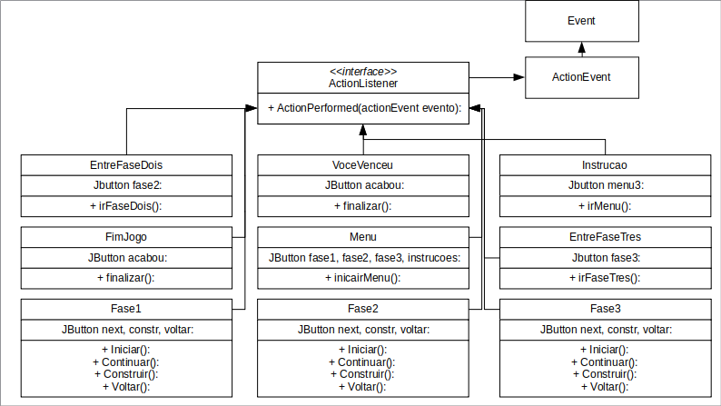
## Código do Patern
# Conclusões e Trabalhos Futuros
# Documentação dos Componentes
# Diagramas

## Diagrama Geral do Projeto
## Diagrama Geral de Componentes

### Componente Tabeleiro

Este componente representa todos os tabuleiros gerados no jogo. Ele interage com todas as peças do jogo, já que os tabuleiros possuim uma matriz de peças, interage com o recurso, ja que cada tabuleiro possui seus determinados recursos no início do jogo e interage com todas as fases, já que cada fase do jogo nescessáriamente possui um tabuleiro.

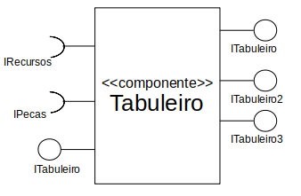

#### Ficha Técnica

|Item|Detalhamento|
|:-----:|:------:|
|Classe||
|Autores|Pedro Hori Bueno, Matheus Augusto da Silva Cândido|
|Interfaces|ITabuleiro, ITabuleiroDois, ITabuleiroTres|

### Componente Aliadas

Este componente representa todas as peças aliadas do jogo (que o jogador pode construir). Ele interage com o tabuleiro, pois as peças são construidas no tabuleiro, e também interage com o recurso, pois para o jogador construir novas peças aliadas ele gasta uma determinada quantidade de recurso.

#### Ficha Técnica

|Item|Detalhamento|
|:-----:|:------:|
|Classe||
|Autores|Pedro Hori Bueno, Matheus Augusto da Silva Cândido|
|Interfaces|IPeças|

### Componente Inimigas

Este componente representa todas as peças inimigas do jogo (os monstros que invadem o tabuleiro). Ele interage com o tabuleiro, pois as peças inimigas surgem no tabuleiro e interagem nele.

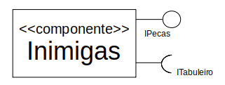

#### Ficha Técnica

|Item|Detalhamento|
|:-----:|:------:|
|Classe||
|Autores|Pedro Hori Bueno, Matheus Augusto da Silva Cândido|
|Interfaces|IPeças|

### Componente Neutras

Este componente representa todas as peças neutras do jogo, que são posiconas no tabuleiro quando ele é gerado. Desta forma, este componente também interage com o tabuleiro.

#### Ficha Técnica

|Item|Detalhamento|
|:-----:|:------:|
|Classe||
|Autores|Pedro Hori Bueno, Matheus Augusto da Silva Cândido|
|Interfaces|IPeças|

### Componente Vazio

Este componente representa todas as peças da classe vazio presentes no tabuleiro, ou seja, todas as células vazias.

#### Ficha Técnica

|Item|Detalhamento|
|:-----:|:------:|
|Classe||
|Autores|Pedro Hori Bueno, Matheus Augusto da Silva Cândido|
|Interfaces|IPeças|

### Componente Recursos

Este componente representa o recurso do tabuleiro.

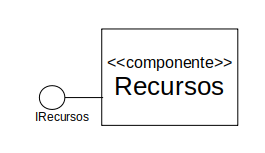

#### Ficha Técnica

|Item|Detalhamento|
|:-----:|:------:|
|Classe||
|Autores|Pedro Hori Bueno, Matheus Augusto da Silva Cândido|
|Interfaces|IRecursos|

### Componente Fase1

Este componente representa a fase 1 do jogo. Como a fase um é composta por um tabuleiro, este componente interage com tabuleiro.

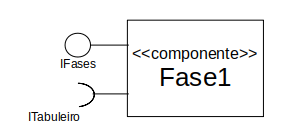

#### Ficha Técnica

|Item|Detalhamento|
|:-----:|:------:|
|Classe||
|Autores|Pedro Hori Bueno, Matheus Augusto da Silva Cândido|
|Interfaces|IFases|

### Componente Fase2

Este componente representa a fase 2 do jogo. Como a fase dois é composta por um tabuleiro, este componente interage com tabuleiro. Esta interação ocorre pela interface ITabuleiroDois, que determina os monstros da segunda fase.

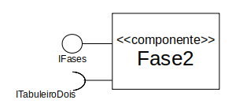

#### Ficha Técnica

|Item|Detalhamento|
|:-----:|:------:|
|Classe||
|Autores|Pedro Hori Bueno, Matheus Augusto da Silva Cândido|
|Interfaces|IFases|

### Componente Fase3

Este componente representa a fase 3 do jogo. Como a fase três é composta por um tabuleiro, este componente interage com tabuleiro. Esta interação ocorre pela interface ITabuleiroTres, que determina os monstros da terceira fase.

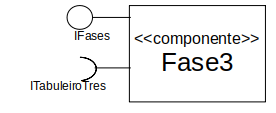

#### Ficha Técnica

|Item|Detalhamento|
|:-----:|:------:|
|Classe||
|Autores|Pedro Hori Bueno, Matheus Augusto da Silva Cândido|
|Interfaces|IFases|

### Interfaces

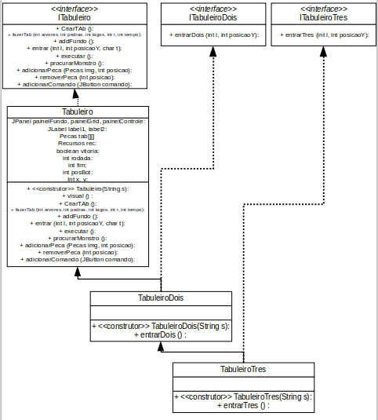

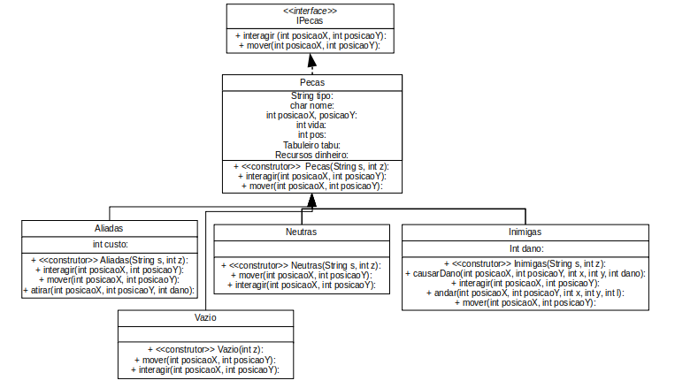

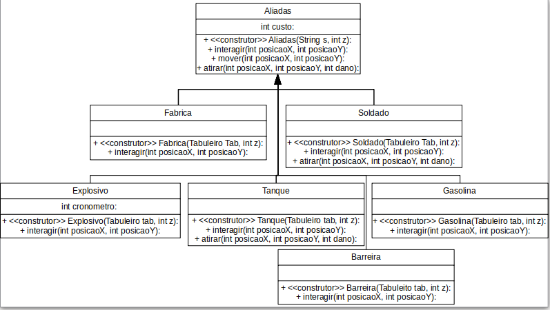

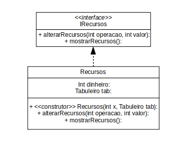

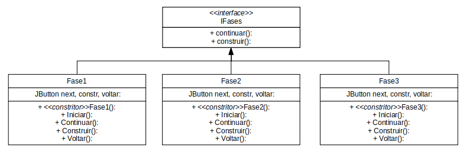

## Detalhamento das Interfaces

### Interface ITabuleiro

Interface impelemntada por todos os tabuleiros criados durante o jogo, determinando seu comportamento.

|Método|Objetivo|
|:-----:|:------:|
|CriarTab|Cria um novo tabuleiro com espaços vazios|
|fazerTab|Configura o tabuleiro adicionando peças neutras, recursos iniciais e a quantidade de rodadas|
|addFundo|Adiciona o fundo da fase|
|entrar|Adiciona novos monstros ao tabuleiro|
|executar|Percorre o tabuleiro fazendo as peças efetuarem suas ações|
|procurarMonstro|Verifica se existem monstros no tabuleiro|
|adicionarPeca|Adiciona uma peça ao tabuleiro|
|removerPeca|Remove uma peça do tabuleiro|
|adicionarComando|Adiciona um botão ao tabuleiro|

### Interface ITabuleiroDois

Interface implementada pelo tabuleiro da fase dois (serve para determinar o padrão de entrada de monstros novos no mapa na segunda fase).

|Método|Objetivo|
|:-----:|:------:|
|entrarDois|Determina como novos monstros entram no tabuleiro|

### Interface ITabuleiroTres

Interface implementada pelo tabuleiro da fase três (serve para determinar o padrão de entrada de monstros novos no mapa na terceira fase).

|Método|Objetivo|
|:-----:|:------:|
|entrarTres|Determina como novos monstros entram no tabuleiro|

### Interface IPecas

Interface implementada por todas as peças do jogo, inclusive células vazia. Esta interface permite que todas as células do tabuleiro seja composto por objetos que implementam a mesma interface, possibilitando interações mais simples e eficientes durante o código.

|Método|Objetivo|
|:-----:|:------:|
|interagir|Faz com que uma peça efetue sua interação no tabuleiro|
|mover|Faz com que uma peça efetue seu movimento no tabueliro|

### Interface IRecursos

Interface implementada pelo recurso do jogo presente em cada uma das fases. Esta interface permite que as devidas operações sejam feitas para altarar a quantidade de recursos e mostrar os recursos que o jogador possui durante a fase.

|Método|Objetivo|
|:-----:|:------:|
|alterarRecursos|Altera os recursos do jogador|
|mostrarRecursos|Mostra os recursos do jogador na tela|

### Interface IFases

Interface implementada pelas fases do jogo. Esta interface permite ao jogador fazer ações durante a fase, um elemento central do jogo.

|Método|Objetivo|
|:-----:|:------:|
|continuar|Avança em um a rodada de determinada fase e faz todas as peças do tabuleiro efetuarem suas interações|
|construir|Permite que o jogador construa unidades no tabueliro|

### Interface IJanela

Interface implementada pelas janelas abertas do jogo. Esta interface possibilita a criação de novas janelas do jogo.

|Método|Objetivo|
|:-----:|:------:|
|janelaVisual|Cria e abre uma nova janela do jogo|

# Plano de Exceções
## Diagrama da Hierarquia de excessões

## Descrição das classes de exceção

|Classe|Descrição|
|:-----:|:------:|
|Excecao|Engloba todas as exceções na conversão de String para int|
|ExcecaoX|Verifica e solicita ao usuario um valor que possa ser convertido para int para a coordenada x|
|ExcecaoY|Verifica e solicita ao usuario um valor que possa ser convertido para int para a coordenada y|

